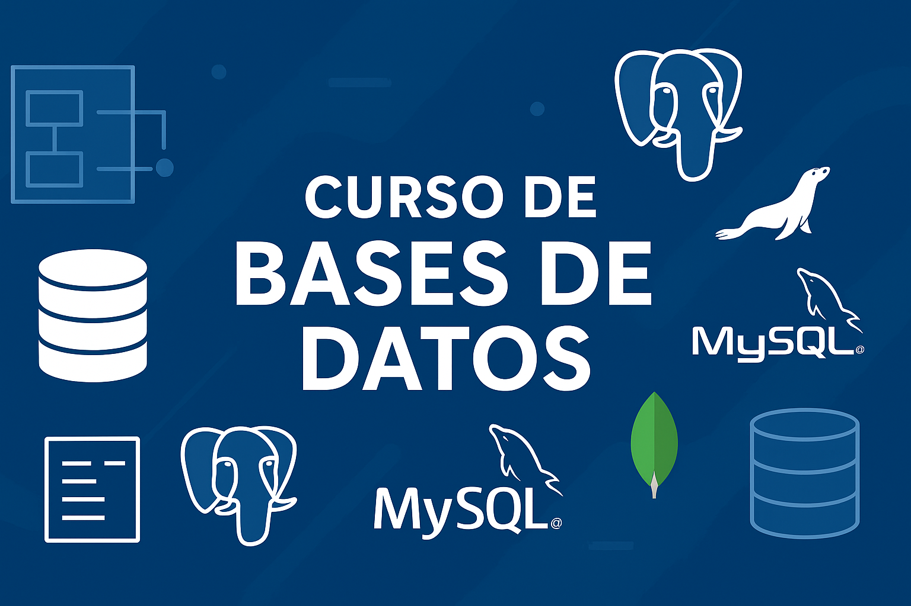

  

# Curso de Bases de Datos

Este repositorio contiene los materiales del curso **Bases de Datos**, enfocado en el diseño, modelado y uso de sistemas de gestión de datos relacionales y NoSQL. Está dirigido a estudiantes y entusiastas de la informática que deseen comprender desde los conceptos fundamentales hasta la práctica con consultas SQL y bases de datos NoSQL.

## 🎯 Objetivos Generales

- Conceptualizar la Base de Datos de un determinado problema mediante el modelaje de datos en distintos niveles de abstracción: conceptual, lógico y físico.

---

## 🧠 Contenido del Curso

### Unidad 1: Introducción a las Bases de Datos

- Definición de bases de datos  
- Reseña histórica  
- Tipos de bases de datos:  
  - SQL  
  - NoSQL  
- Ventajas  
- Modelado de datos:  
  - Modelo Lógico  
  - Modelo Físico  
  - Modelo Relacional  
- Sistemas de Gestión de Bases de Datos (RDBMS):  
  - PostgreSQL  
  - MySQL  
- Introducción al uso de UML en bases de datos

---

### Unidad 2: Diseño de Bases de Datos

- Modelo Entidad-Relación (E-R):  
  - Tablas  
  - Atributos  
  - Relaciones  
  - Cardinalidades  
  - Tipos de datos  
  - Llaves primarias y foráneas  
  - Restricciones  
- Técnicas de diagramación  
- Diagramas UML aplicados a bases de datos

---

### Unidad 3: Lenguaje SQL y Operaciones CRUD

- Concepto y ventajas del lenguaje SQL  
- Operaciones CRUD:  
  - Crear  
  - Leer (SELECT)  
  - Actualizar (UPDATE)  
  - Eliminar (DELETE)  
- Uso de JOINs y operadores adicionales

---

### Unidad 4: Normalización

- Teoría de normalización de bases de datos relacionales  
- Formas normales:  
  - 1FN (Primera Forma Normal)  
  - 2FN (Segunda Forma Normal)  
  - 3FN (Tercera Forma Normal)

---

### Unidad 5: Introducción a las Bases de Datos NoSQL

- Concepto y características  
- Ventajas y desventajas  
- MongoDB  
- Operaciones CRUD en NoSQL

---

## 📘 Licencia

Este material se distribuye bajo la licencia [Creative Commons Attribution-ShareAlike 4.0 International (CC BY-SA 4.0)](https://creativecommons.org/licenses/by-sa/4.0/deed.es).

---

## ✍️ Autor

Gerardo Alí Ferraro Schelijasch  
Contacto: gerferr83@soltecferr.com
Página web: www.soltecferr.com
